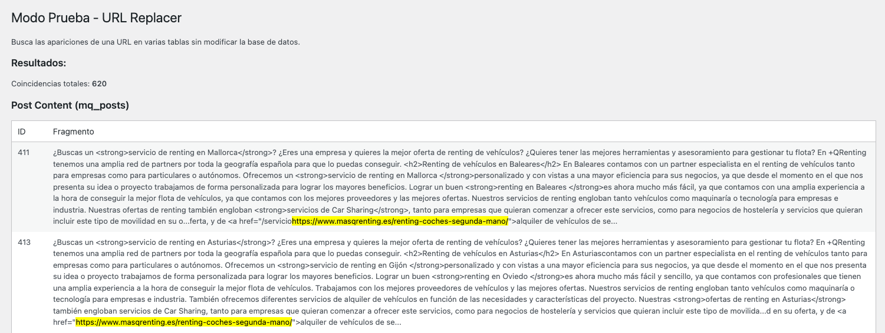
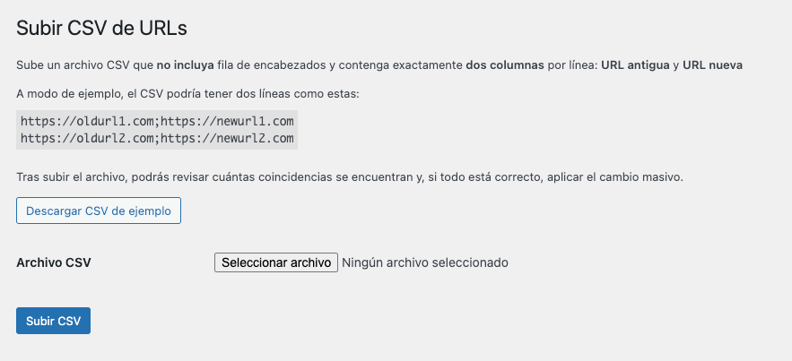

# URL Replacer Plugin

[](https://www.gnu.org/licenses/gpl-2.0.html)

URL Replacer es un plugin esencial para WordPress diseñado para la **búsqueda y reemplazo seguro de URLs directamente en la base de datos**. Ofrece funcionalidades como el respeto por la serialización de datos, modo de prueba, procesamiento por lotes mediante CSV y un sistema robusto de logging para auditoría.

## Requisitos

- **WordPress**: >= 6.0
- **PHP**: >= 7.4
- **Extensiones PHP**: `mysqli` (incluida por defecto)
- **Permisos WP**: `manage_options` (Administrador)
- **Permisos de archivo**: Escritura en `/wp-content/uploads/`

## Características

Este plugin se enfoca en la seguridad y eficiencia durante las migraciones y actualizaciones de URLs.

### Funcionalidades

- **Modo de Prueba (Dry Run)**: Permite localizar y contabilizar el número de coincidencias de la URL antigua sin realizar ninguna modificación en la base de datos.
- **Reemplazo Seguro**: Realiza el reemplazo de la URL en tablas clave de WordPress (posts, postmeta, termmeta, etc.).
- **Respeto a la Serialización**: Implementa una lógica de búsqueda/reemplazo que preserva la integridad de los datos serializados (arrays y objetos PHP).
- **Procesamiento Masivo por CSV**: Permite subir un archivo con múltiples pares [URL antigua, URL nueva] para ejecutar reemplazos por lotes.
- **Registro Detallado (Logging)**: Genera un archivo url-replacer-log.txt con un registro exhaustivo de todos los cambios aplicados, facilitando la auditoría.
- **Descarga de Logs**: Interfaz de administración para descargar el historial de cambios directamente.

### Aspectos Técnicos

- **Integridad de Datos**: Compatibilidad nativa con el formato de datos serializado de WordPress.
- **Seguridad**: Uso de $wpdb->prepare() en todas las consultas de la base de datos para prevenir inyecciones SQL.
- **Optimización**: Mecanismo de procesamiento por lotes optimizado para manejar grandes volúmenes de datos sin agotar el tiempo de ejecución.
- **Robustez**: Validación y sanitización completa de todos los inputs de usuario.
- **Recuperación**: El logging detallado permite un potencial rollback manual de los cambios utilizando la información del historial.

## Protocolo de uso y buenas prácticas

⚠️ **Advertencia:** Este plugin realiza modificaciones directas en la base de datos. Siga estrictamente los siguientes pasos para mitigar cualquier riesgo.

1. **Backup Completo:** Antes de cualquier ejecución, realice un backup completo y verificable de la base de datos y los archivos de su sitio.
2. **Entorno de Staging:** Nunca use este plugin por primera vez en producción. Pruebe y valide la funcionalidad en un entorno de desarrollo o staging idéntico al de producción.
3. **Validación de Permisos:** Asegúrese de usar una cuenta con permisos `manage_options` (Administrador).
4. **Verificación Previa:** Siempre ejecute el Modo Prueba (Dry Run) antes de aplicar un reemplazo real.

## Estructura del proyecto

```
url-replacer-plugin/
├── url-replacer/
│   ├── url-replacer.php          # Archivo principal del plugin
│   ├── includes/
│   │   ├── class-url-replacer-admin.php      # Interfaz de administración
│   │   ├── class-url-replacer-processor.php  # Motor de búsqueda/reemplazo
│   │   ├── class-url-replacer-csv.php        # Procesador de archivos CSV
│   │   └── class-url-replacer-logger.php     # Sistema de logging
│   └── assets/
│       └── sample.csv            # Archivo CSV de ejemplo
└── README.md
```

## Instalación

### Método 1: Clonar el repositorio

Ideal para desarrolladores o entornos de staging con acceso shell/SSH.

1. Navegue al directorio de plugins de su instalación de WordPress:
   ```bash
   cd wp-content/plugins/
   ```
2. Clone el repositorio:
   ```bash
   git clone https://github.com/rociobenitez/url-replacer-plugin.git url-replacer
   ```
3. Active el plugin desde la sección Plugins del panel de administración de WordPress.

### Método 2: Instalar mediante archivo `.zip`

Este es el método estándar y más seguro para entornos de producción.

1. Descargue el archivo `.zip` de la última versión estable desde la sección [**Releases**](https://github.com/rociobenitez/url-replacer-plugin/releases) de este repositorio. También puede comprimir manualmente la carpeta `url-replacer/`.
2. En el panel de administración de WordPress, vaya a: **Plugins → Añadir nuevo → Subir plugin**
3. Seleccione el archivo `.zip` descargado y haga clic en “Instalar ahora”.
4. Una vez finalizada la instalación, haga clic en “Activar plugin”.

> [!NOTE]
> Tras la activación, el menú principal del plugin estará disponible como URL Replacer en el escritorio de WordPress.

## Guía de uso

1. **Modo Prueba (Dry Run)**

   - Pestaña: **URL Replacer** → **Modo Prueba**.
   - Acción: Introduzca la URL antigua y ejecute la búsqueda.
   - Resultado: El sistema devolverá el **número de coincidencias totales** sin afectar la base de datos.

2. **Reemplazar URLs (una sola)**

   - Pestaña: **URL Replacer** → **Reemplazar URLs**.
   - Acción: Ingrese la URL a buscar y la URL de reemplazo. Confirme para iniciar la operación.
   - Resultado: El sistema realiza el reemplazo seguro y genera una entrada en el archivo de logs.

3. **Subir CSV (varias URLs a la vez)**

   - Pestaña: **URL Replacer** → **Subir CSV**.
   - Acción: Suba un archivo CSV. El sistema pre-analiza el archivo.
   - Resultado: Muestra las coincidencias por cada par de URLs antes de permitir el reemplazo en bloque.

4. **Descargar Log**:
   - Pestaña: **URL Replacer** → **Descargar Log**.
   - Acción: Descarga el archivo `url-replacer-log.txt` para auditoría y seguimiento.

<p align="center" style="margin-top: 24px;">
  
</p>

### Configuración del CSV

El archivo CSV debe seguir un formato simple de dos columnas sin cabeceras, utilizando el punto y coma (`;`) como delimitador:

```
https://oldsite.com/page1;https://newsite.com/page1
https://oldsite.com/page2;https://newsite.com/page2
#...
```



> [!TIP]
> Se incluye un [archivo de ejemplo](url-replacer/assets/sample.csv) en el repositorio para facilitar la estructura.

### Tablas y columnas afectadas

El motor de reemplazo está diseñado para actuar de forma selectiva, impactando solo en las siguientes tablas y columnas estándar de WordPress:

- `{prefijo}_posts` (columna `post_content`)
- `{prefijo}_postmeta` (columna `meta_value`)
- `{prefijo}_termmeta` (columna `meta_value`)

> **Nota:** `{prefijo}` hace referencia al prefijo de tabla configurado en su wp-config.php.

### Logs y auditoría

- **Ruta del Log:** `/wp-content/uploads/url-replacer-log.txt`
- **Contenido del Log:** Cada entrada incluye timestamp, tabla afectada, ID del registro y el tipo de cambio.
- **Uso del Log:** Es fundamental conservar el archivo de logs para futuras auditorías o para facilitar la reversión manual de cambios si fuera necesario.

## Preguntas frecuentes (FAQs)

**¿Es seguro ejecutarlo en un sitio en producción?**
Sí, es seguro, siempre y cuando se haya realizado un backup completo previamente. El diseño prioriza la seguridad y la integridad de los datos.

**¿Cómo maneja el plugin los datos serializados?**
El motor de reemplazo incluye una lógica específica que detecta, deserializa, modifica la cadena de URL, y vuelve a serializar los datos con la longitud correcta, garantizando la integridad del array/objeto.

**¿El plugin ofrece una función de Rollback (reversión automática)?**
No. Actualmente, no hay una función de reversión automática. Sin embargo, el registro detallado (logs) permite a un desarrollador identificar los cambios aplicados y realizar un rollback manual mediante consultas SQL si se requiere.

**¿Funciona correctamente en entornos de WordPress Multisite?**
El plugin está diseñado para su uso en instalaciones de sitio único. En un entorno Multisite, funcionará únicamente en la base de datos del sub-sitio en el que esté activado y se ejecute.

## Contribuciones

Se agradece cualquier aporte para mejorar la estabilidad, seguridad y funcionalidad. Si desea contribuir:

1. Cree un **Issue** para discutir la mejora o el _bug_ antes de iniciar el desarrollo.
2. Realice un fork del repositorio.
3. Cree su rama de desarrollo: `git checkout -b feature/nombre-de-la-mejora`.
4. Realice sus commits y asegúrese de que el código sigue los estándares de WordPress.
5. Abra un Pull Request claro y conciso en GitHub.

## Soporte

Para asistencia o reporte de errores:

- **Issues**: Utilice la sección [Issues](https://github.com/rociobenitez/url-replacer-plugin/issues) de este repositorio
- **Soporte directo**: [rociodev2403@gmail.com](mailto:rociodev2403@gmail.com)

## Licencia

Este proyecto se distribuye bajo la licencia [GPL v2 o posterior](https://www.gnu.org/licenses/gpl-2.0.html).
