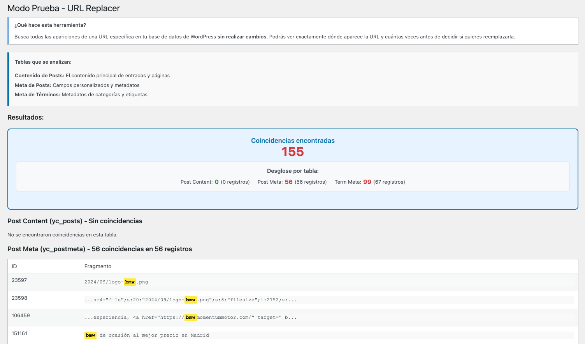

# URL Replacer Plugin

[](https://www.gnu.org/licenses/gpl-2.0.html)

Plugin de WordPress para **buscar y reemplazar URLs** en la base de datos, con modo de prueba, reemplazo seguro (respeta serialización), soporte para subir un CSV y registro de logs.

## Características

- **Modo Prueba**: localiza coincidencias de una URL y muestra cuántas apariciones hay.
- **Modo Reemplazo**: reemplaza la URL antigua por la nueva en tablas como `posts`, `postmeta`, `termmeta`, etc.
- **Respeto de la Serialización**: evita corromper campos serializados.
- **Subir CSV**: permite subir un archivo con pares `[URL antigua, URL nueva]` y procesar masivamente.
- **Log de Cambios**: genera un archivo `url-replacer-log.txt` con los registros de cambios.
- **Descarga del Log**: desde el panel de WordPress.

## Requisitos

- WordPress >= 6.0
- PHP >= 7.2

## Instalación

### Método 1: Clonar el repositorio

1. En tu servidor local o remoto, ve a la carpeta `wp-content/plugins/`.
2. Ejecuta:
   ```bash
   cd wp-content/plugins/
   git clone https://github.com/rociobenitez/url-replacer-plugin.git url-replacer
   ```
3. Activa el plugin en tu panel de administración de WordPress.
4. Accede al menú **URL Replacer** en el escritorio de WordPress.

Buena pregunta, Rocío. Aquí tienes la forma más clara y técnica de **adaptar esa sección del README** para explicar el **Método 2: instalación mediante `.zip`**, teniendo en cuenta que el `.zip` estará disponible en la pestaña **"Releases"** del repositorio:

### Método 2: Instalar mediante archivo `.zip`

Este método es ideal para sitios en producción, si no deseas clonar el repositorio o no tienes acceso por FTP/SFTP.

1. Descarga la última versión estable del plugin en formato `.zip` desde la sección [**Releases**](https://github.com/rociobenitez/url-replacer-plugin/releases) de este repositorio. También puedes comprimir manualmente la carpeta `url-replacer/`.
2. En el panel de administración de tu WordPress, ve a: Plugins → Añadir nuevo → Subir plugin
3. Selecciona el archivo `.zip` descargado.
4. Haz clic en “Instalar ahora” y luego en “Activar plugin”.
5. Accede al menú **URL Replacer** en el panel de WordPress para comenzar a usarlo.

> [!NOTE]
> Si no ves la sección "Releases", puedes acceder directamente a ella desde:  
> `https://github.com/rociobenitez/url-replacer-plugin/releases`

## Uso

1. **Modo Prueba**

   - Ve a **URL Replacer** → **Modo Prueba** e introduce la URL antigua.
   - El plugin buscará coincidencias en la base de datos sin modificar nada.

2. **Reemplazar URLs (una sola)**

   - Ve a **URL Replacer** → **Reemplazar URLs**.
   - Indica la URL antigua y la nueva.
   - El plugin actualizará todas las apariciones de esa URL en las tablas definidas (posts, postmeta, termmeta...).
   - Se respetan los campos serializados y se generará un log si se realizan cambios.

3. **Subir CSV (varias URLs a la vez)**

   - Ve a **URL Replacer** → **Subir CSV**.
   - Sube un archivo con dos columnas (sin cabecera): `[url_antigua;url_nueva]`.
   - Verás cuántas coincidencias totales hay para cada par, y podrás aplicar el reemplazo en bloque.

4. **Descargar Log**:
   - Desde **URL Replacer** → **Descargar Log** puedes obtener un archivo `.txt` con los reemplazos realizados recientemente.

<p align="center" style="margin-top: 24px;">
  
</p>

## Ejemplo de CSV

Por defecto, se asume que cada línea está separada por `;` y **no hay cabeceras**. Cada línea debe tener esta estructura:

```
https://oldsite.com/page1;https://newsite.com/page1
https://oldsite.com/page2;https://newsite.com/page2
```


> [!TIP]
> Puedes descargar un [archivo de ejemplo](url-replacer/assets/sample.csv) si no quieres crearlo desde cero. Solo modifica las líneas para tus URLs reales.

## Contribuciones

¡Las contribuciones son bienvenidas! Para sugerir mejoras, crea un **issue** o haz un **pull request**:

1. Haz un fork del repositorio.
2. Crea una rama para tu feature/fix: `git checkout -b feature-mi-feature`.
3. Realiza tus cambios y comitea: `git commit -m "Añadir mi feature"`.
4. Haz push de tu rama: `git push origin feature-mi-feature`.
5. Abre un pull request en GitHub.

## Soporte

Para cualquier duda o reporte de errores:

- Crea un **issue** en este repositorio (pestaña “Issues”).
- O envía un email a [rociodev2403@gmail.com](mailto:rociodev2403@gmail.com).

Si necesitas ayuda personalizada, contáctame.

## Licencia

Este proyecto se distribuye bajo la [GPL v2 o posterior](https://www.gnu.org/licenses/gpl-2.0.html).
